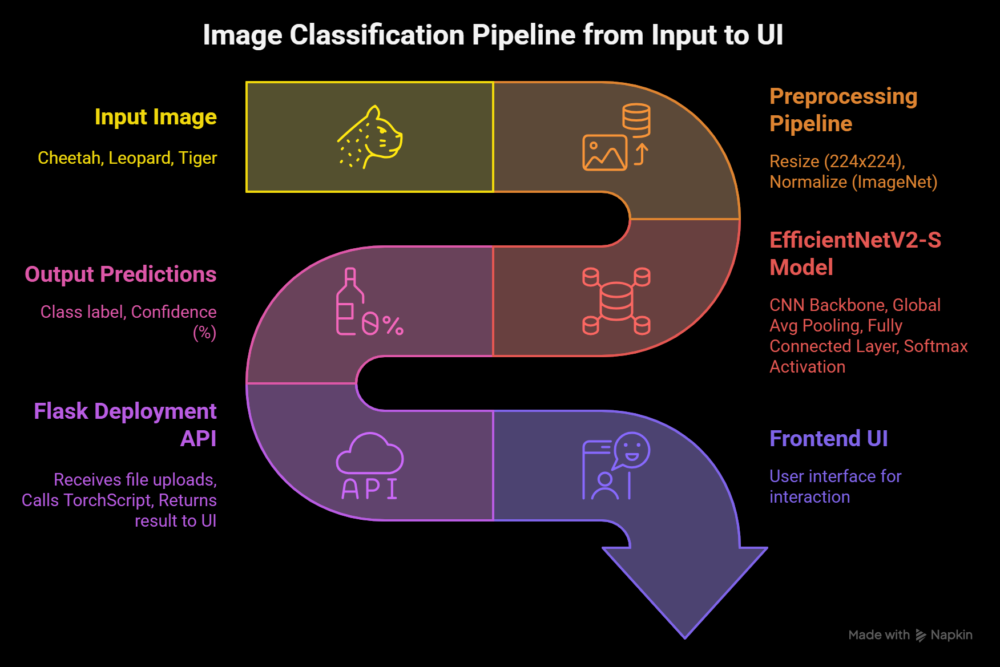
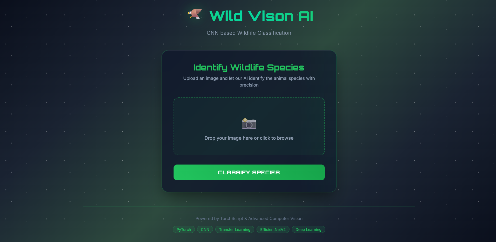

# Wildlife Image Classifier

---

## 📸 Project Overview

This is an AI Powered Image Classification System that identifies wild Aniamls like:
- Cheetah
- Leopard
- Tiger

Using **Deep Learning + Computer Vision + Transfer Learning**, this project leverages **EfficientNetV2-S** — one of the most state-of-the-art CNN architectures — to deliver high-accuracy animal identification.

---

## 🎯 Key Features

| Feature | Description |
|---------|-------------|
| **State-of-the-art Model** | Uses EfficientNetV2-S architecture for high accuracy and efficient training |
| **Transfer Learning** | Pre-trained on ImageNet, fine-tuned on custom wildlife dataset |
| **Data Augmentation** | Increases dataset diversity with random flips, rotations, and color jitter |
| **Early Stopping** | Prevents overfitting during training |
| **TorchScript Export** | Model saved in TorchScript format for fast and optimized inference |
| **Fully Automated Inference Pipeline** | Automatically handles preprocessing, model loading, and prediction |
| **Web Deployment (Flask)** | Flask backend handles image uploads and predictions |
| **Web UI** | Clean and modern interface to upload images and get predictions |
| **End-to-End Deployment** | Can run locally or be deployed to cloud platforms |

---

## 🔧 Tech Stack

| Module         | Description                      |
|----------------|-----------------------------------|
| **PyTorch**    | Deep Learning Framework          |
| **EfficientNetV2-S** | Transfer Learning Backbone |
| **Albumentations** | Advanced Data Augmentations |
| **TorchScript** | Model Export Format for Inference |
| **Flask**      | Backend Web Server               |
| **HTML/CSS**   | Frontend Web Interface |
| **OpenCV**     | Image Preprocessing              |

---

## 📊 Model Pipeline



**1️⃣ Input Image (Cheetah, Leopard, Tiger):**

- User uploads an image of any of the 3 target animals.
- This is the raw data entry point.

**2️⃣ Preprocessing Pipeline:**

- Resize image to 224x224 pixels — required input size for EfficientNetV2-S.
- Normalize using ImageNet statistics (mean/std).
- Ensures consistency with pretrained model expectations.

**3️⃣ EfficientNetV2-S Model (Core Deep Learning Engine):**

Uses:
- CNN backbone (convolutional layers extract visual features: textures, patterns, shapes).
- Global Average Pooling (reduces dimensionality while preserving spatial features).
- Fully Connected Layer (classification layer with 3 outputs for 3 classes).
- Softmax Activation (produces class probabilities).

**4️⃣ Output Predictions:**

Model returns:
- Class label (Cheetah, Leopard, Tiger).
- Confidence score (ex: 93% confidence it’s a Tiger).

**5️⃣ Flask Deployment API:**

Backend server:
- Receives uploaded images.
- Applies preprocessing.
- Runs inference using the TorchScript exported model.
- Sends prediction results back to UI.

**6️⃣ Frontend UI:**

- User interface where:
- Users upload images.
- View predictions.
- Clean, futuristic design for smooth interaction.

---

## ⚙️ Setup Instructions

### 1️⃣ Clone the repository:
   ```bash
   git clone https://github.com/SrujanPR/Animal-Classification.git
   cd Animal-Classification
   ```

### 2️⃣ Install Dependencies

```bash
pip install -r requirements.txt
```

### 3️⃣ Model Training

There is `EfficientNetV2_Model.ipynb` python notebook in this project. You can copy use that to train the model from scratch using your own dataset in google colab and save the trained model file.

I have already completed the training with a dataset of 5000 images and I have also saved the best trained model file as `efficientnetv2_model2_inference.pt`. This is also available in this project directory.

### 4️⃣ Setup the FastAPI backend server:

run the flask app using the command:
```bash
python app.py
```

### 5️⃣ Access the Web App

Open your browser and go to this URL: (http://127.0.0.1:5000)
The webapp will open and you can use this.

---

## 📸 Demo Screenshot



---

## 💡 Future Improvements

- 🔬 Add more animal classes 🐻 🐘 🦁
- 📱 Build a mobile version (Flutter + TensorFlow Lite)
- 🧮 Add Continuous Model Training Pipeline (MLOps)

---

## 📜 License

This project is licensed under the MIT License.

---

## 📢 Credits

- Built by SRUJAN PR 🧠
- Model powered by EfficientNetV2-S
- Inspired by the beauty of wildlife 🌿
- Feel free to reach out for collaborations, ideas, or improvements.
[LinkedIn](https://www.linkedin.com/in/srujanpr)

---

## ⭐ Star this repo if it helped you!

---
